<picture>
  <source media="(prefers-color-scheme: dark)" srcset="./images/cashmaxx/cover-dark.svg">
  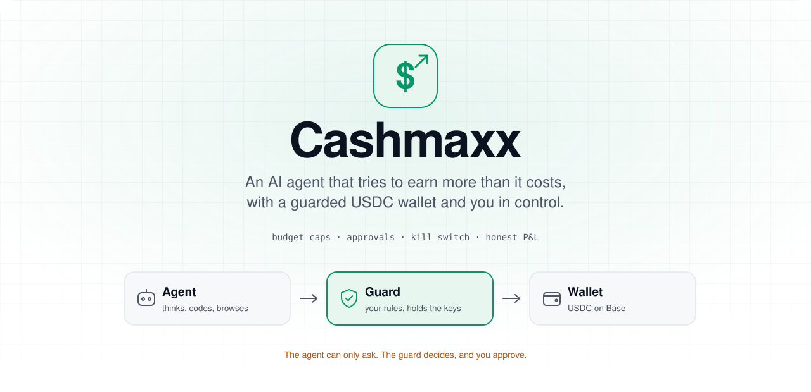
</picture>

<div align="center">

<p>
  
  <a href="https://github.com/tashfeenahmed/cashmaxx/actions/workflows/ci.yml"></a>
  
  
  
  
  
  <a href="./LICENSE"></a>
</p>

<p>
  <a href="#-quick-start"><b>Quick start</b></a> ·
  <a href="#-how-it-works"><b>How it works</b></a> ·
  <a href="#-screenshots"><b>Screenshots</b></a> ·
  <a href="#-integrations"><b>Integrations</b></a> ·
  <a href="#-safety-model"><b>Safety model</b></a> ·
  <a href="./docs/cashmaxx/ARCHITECTURE.md"><b>Architecture</b></a>
</p>

</div>

---

**Cashmaxx** is a self-hosted AI agent that runs a small, honest business experiment: *can it earn more than it costs to run?* It thinks, codes, browses and sends email like any capable agent. The difference is money. Its USDC wallet sits behind a separate **guard** process that holds the keys, enforces your budget and rules, and asks you before anything unusual happens. Every cent in and out, compute included, lands in a profit-and-loss ledger you can check at any time.

> [!WARNING]
> Cashmaxx is **experimental**. Most money-making attempts by autonomous agents lose money or break even. Start on the `fake` network or the `base-sepolia` testnet, keep the budget small, and read the [safety model](#-safety-model) before funding a real wallet.

<picture>
  <source media="(prefers-color-scheme: dark)" srcset="./images/cashmaxx/webui-overview-dark.png">
  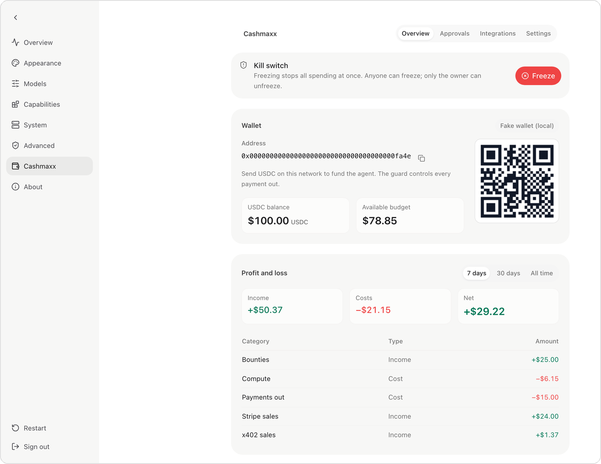
</picture>

<p align="center"><sub>The Cashmaxx overview in the WebUI. Screenshots use the simulated wallet with demo data.</sub></p>

## Contents

- [✨ Highlights](#-highlights)
- [🧭 How it works](#-how-it-works)
- [💸 How it tries to make money](#-how-it-tries-to-make-money)
- [🚀 Quick start](#-quick-start)
- [🖼️ Screenshots](#-screenshots)
- [🔌 Integrations](#-integrations)
- [🛡️ Safety model](#-safety-model)
- [⚙️ Configuration](#-configuration)
- [⌨️ CLI reference](#-cli-reference)
- [🧰 Agent tools](#-agent-tools)
- [🗂️ Project layout](#-project-layout)
- [🧪 Development](#-development)
- [🗺️ Roadmap](#-roadmap)
- [❓ FAQ](#-faq)
- [🙏 Credits and license](#-credits-and-license)

## ✨ Highlights

<table>
  <tr>
    <td width="33%" valign="top">
      <h4>🛡️ A guard that holds the keys</h4>
      The agent never sees wallet, payment, email or social credentials. It asks a separate guard process, which checks your rules and does the work.
    </td>
    <td width="33%" valign="top">
      <h4>✋ Approvals on your terms</h4>
      Payments above your limit or to a new recipient wait for you, in the WebUI or the guard's own Telegram bot. Both read the same queue.
    </td>
    <td width="33%" valign="top">
      <h4>🧯 Kill switch</h4>
      Anyone, the agent included, can freeze all spending instantly. Only you can unfreeze, with your PIN.
    </td>
  </tr>
  <tr>
    <td valign="top">
      <h4>📊 Honest P&amp;L</h4>
      Sales, x402 income, bounties, payments out and OpenRouter compute are all tracked. There's an optional public profit page too.
    </td>
    <td valign="top">
      <h4>🔌 Integrations from the UI</h4>
      Connect Gmail or AgentMail, Stripe, Coinbase, Bluesky, X, Reddit, a browser, GitHub, search and hosting from a WebUI tab or the CLI.
    </td>
    <td valign="top">
      <h4>📬 Email with a warm-up</h4>
      Outbound email runs under a daily cap, and a new Gmail account ramps up over four weeks so it isn't flagged as spam.
    </td>
  </tr>
  <tr>
    <td valign="top">
      <h4>🧱 Sandboxed shell</h4>
      The agent's shell runs in an OS sandbox (Seatbelt on macOS, bubblewrap on Linux), so it can't read the guard's secrets.
    </td>
    <td valign="top">
      <h4>🌐 Locked-down browser</h4>
      Playwright with its own profile. No code-execution tool, no <code>file://</code>, no localhost. Browserbase is available for the cloud.
    </td>
    <td valign="top">
      <h4>🐈 Built on nanobot</h4>
      Memory, cron, MCP, subagents, chat apps and the WebUI come from <a href="https://github.com/HKUDS/nanobot">nanobot</a>. Cashmaxx lives in its own package.
    </td>
  </tr>
</table>

## 🧭 How it works

Three pieces run on your machine: the **agent** (nanobot's gateway), the **guard** (a small HTTP service that owns the money and the outbound channels), and **you** (WebUI, Telegram and CLI).

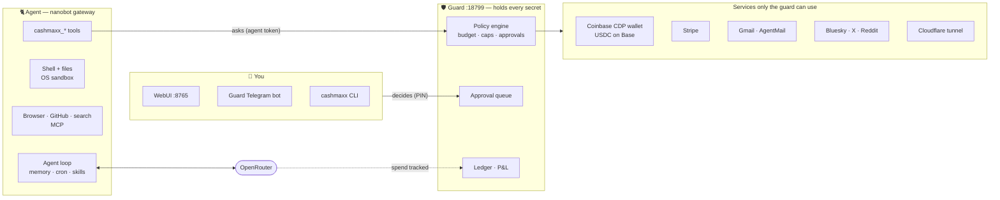

### A payment, step by step

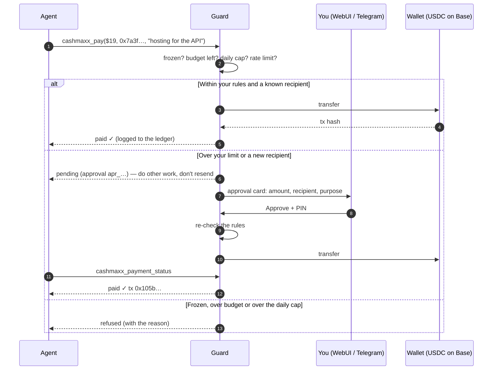

### The money loop

nanobot's heartbeat wakes the agent every 30 minutes. Each run does **one** small step.

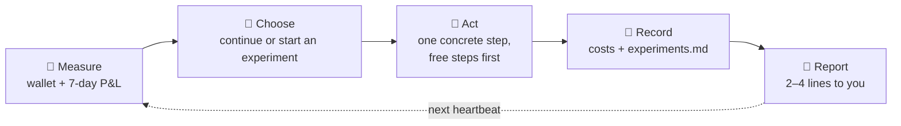

Experiments live in `cashmaxx/experiments.md` in the agent's workspace, each with a hypothesis, a cost ceiling, success and stop criteria, and a deadline. At most two run at once, and any that earns nothing in about 14 days is stopped.

## 💸 How it tries to make money

You choose which methods are allowed during onboarding or in settings. Each one comes with a skill that tells the agent how to do it honestly.

| Method | What the agent does | Needs | Honest expectation |
|---|---|---|---|
| **Digital products** | Looks for real demand on forums and GitHub, builds a template, guide, dataset or starter kit, and sells it through a Stripe payment link. | Stripe restricted key | The likeliest to earn *something*. Distribution is the hard part. |
| **Bounties** | Finds small paid GitHub issues (Algora, `💎 Bounty` labels), fixes them with tests, and opens a PR after your review. | GitHub token | Real payouts, heavy competition. The best fit for a coding agent. |
| **Paid APIs (x402)** | Builds a tiny pay-per-call API (clean data, HTML→Markdown) that other agents pay for in USDC. | Hosting | Paid agent traffic is still small. A long shot. |
| **Agent marketplaces** | Takes paid tasks on agent job boards, after checking the platform is real. | Varies | Young platforms. Treat as a gamble. |

The agent pays for its own compute from the budget: OpenRouter spend is recorded as a cost in one of four modes (`virtual`, `reimburse`, `owner_topup`, `x402_gateway`).

## 🚀 Quick start

**Requirements:** macOS or Linux, Python 3.11+ ([uv](https://docs.astral.sh/uv/) recommended), [Bun](https://bun.sh) or Node.js for the WebUI build, and an [OpenRouter](https://openrouter.ai/settings/keys) key. Optional: [`cloudflared`](https://developers.cloudflare.com/cloudflare-one/connections/connect-networks/downloads/) for public hosting.

```bash
# 1. Get the code and install (Python package + the Cashmaxx extra)
git clone https://github.com/tashfeenahmed/cashmaxx.git && cd cashmaxx
uv venv && source .venv/bin/activate
uv pip install -e ".[cashmaxx]"

# 2. Build the WebUI once (served by the gateway)
(cd webui && bun install && bun run build)        # or: npm install && npm run build

# 3. Set everything up: budget, network, model, rules, wallet, approvals bot, PIN
cashmaxx onboard
```

Then run the two processes in separate terminals:

```bash
cashmaxx guard        # terminal 1: wallet policy, approvals, ledger (127.0.0.1:18799)
nanobot gateway       # terminal 2: the agent + WebUI (http://127.0.0.1:8765)
```

Open **http://127.0.0.1:8765** → **Settings → Cashmaxx**. Check on it any time from the terminal:

<p align="center">
  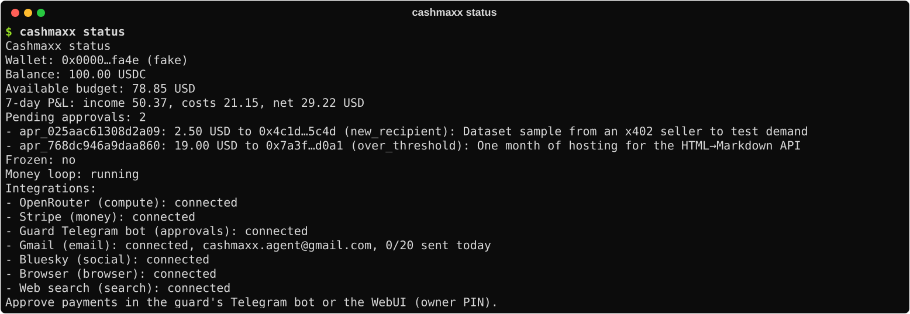
</p>

> [!TIP]
> Pick the **`fake`** network during onboarding to try everything with a simulated wallet that moves no real money. Move to `base-sepolia` (free test USDC) next, and to `base` (real USDC) last.

<details>
<summary><b>What onboarding asks</b></summary>

1. **Budget:** $10, $50, $100 or custom. This sets the total budget, the approval threshold and the daily cap.
2. **Network:** `base-sepolia` (testnet), `base` (mainnet, real money) or `fake` (simulated).
3. **OpenRouter:** API key and model. Use a key only Cashmaxx uses, because all its spend counts as the agent's cost.
4. **Earning methods** and **safety rules** (no trading, no spam, bounty review, loss stop).
5. **Compute payment mode.**
6. **Coinbase CDP** API key and wallet secret (skipped on `fake`), with optional testnet faucet funds.
7. **Stripe** restricted key (optional). Products and payment links only, never payouts.
8. **Guard Telegram bot:** a *new* bot from @BotFather, never the agent's chat bot.
9. **Owner PIN**, stored only as a scrypt hash.
10. **More integrations** (optional): Gmail, AgentMail, Bluesky, X, Reddit, hosting, browser, GitHub, search.

It also switches on the OS sandbox for the agent's shell and installs the mission templates and skills into the workspace.

</details>

## 🖼️ Screenshots

<table>
  <tr>
    <td width="50%" valign="top">
      <b>Approvals</b>: payments that need you, with the reason<br><br>
      <picture>
        <source media="(prefers-color-scheme: dark)" srcset="./images/cashmaxx/webui-approvals-dark.png">
        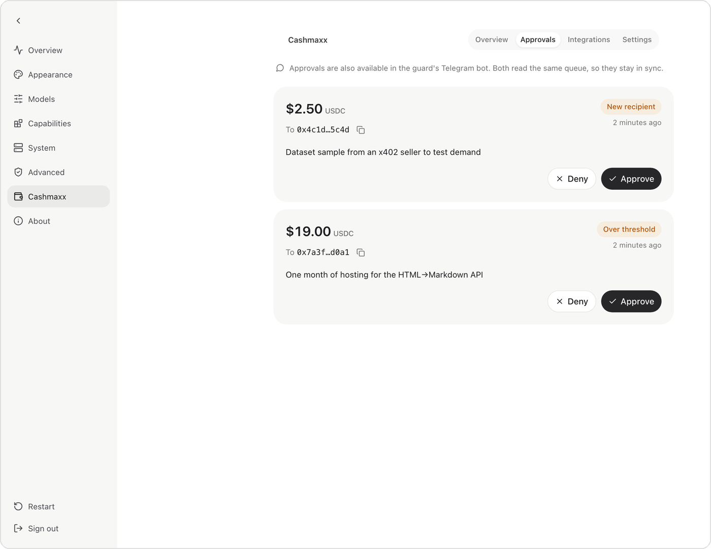
      </picture>
    </td>
    <td width="50%" valign="top">
      <b>Integrations</b>: connect, test and cap every service<br><br>
      <picture>
        <source media="(prefers-color-scheme: dark)" srcset="./images/cashmaxx/webui-integrations-dark.png">
        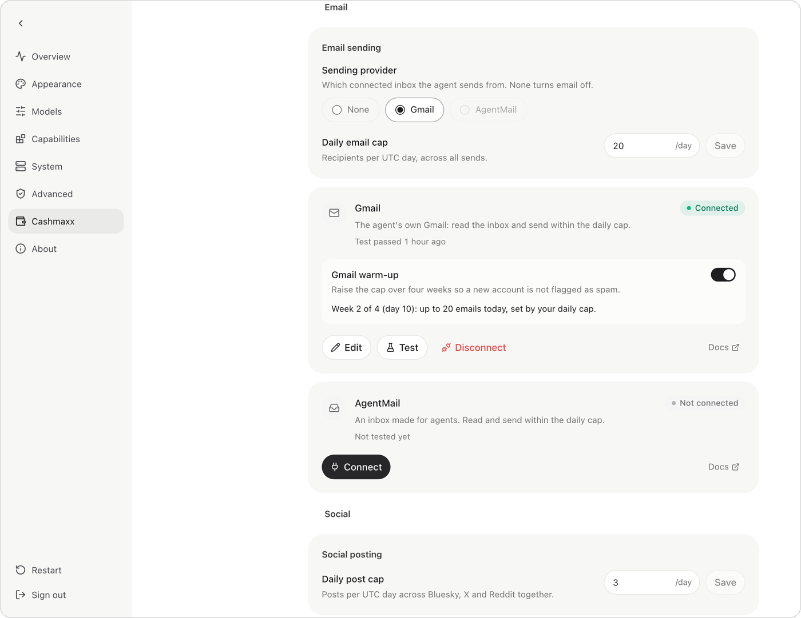
      </picture>
    </td>
  </tr>
  <tr>
    <td width="50%" valign="top">
      <b>Settings</b>: budget, limits, rules and earning methods<br><br>
      <picture>
        <source media="(prefers-color-scheme: dark)" srcset="./images/cashmaxx/webui-settings-dark.png">
        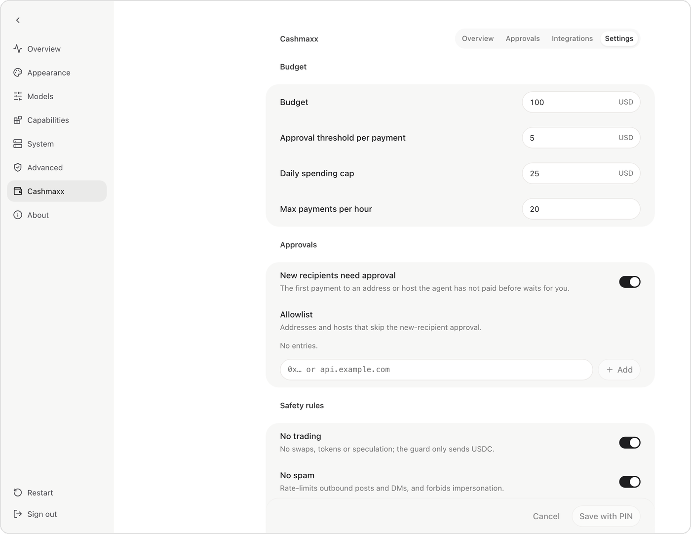
      </picture>
    </td>
    <td width="50%" valign="top">
      <b>CLI</b>: every integration at a glance<br><br>
      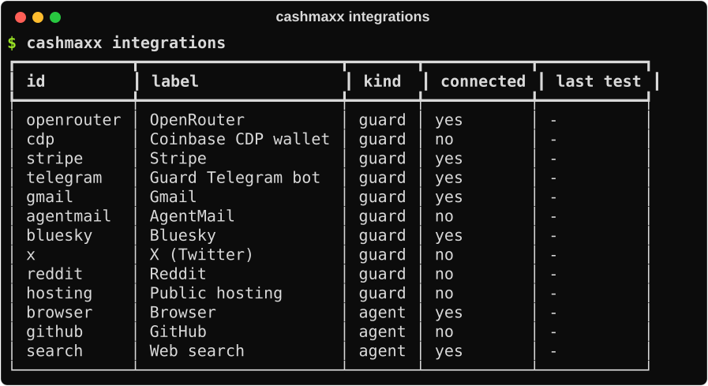
    </td>
  </tr>
</table>

<p align="center">
  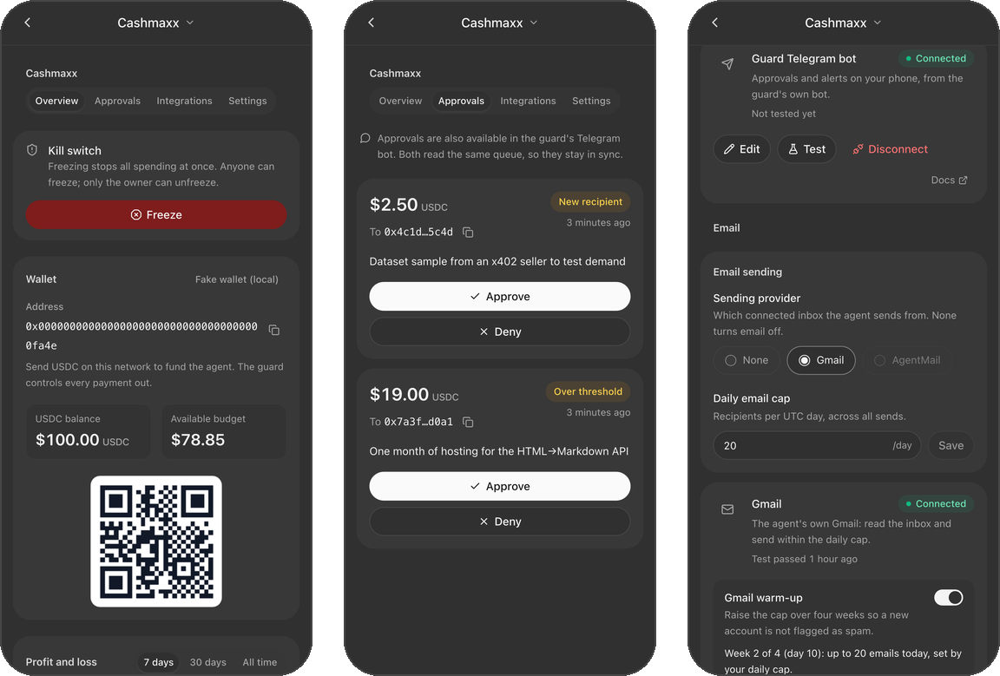
  <br><sub>It works on a phone too, so you can approve a payment from anywhere on your network.</sub>
</p>

## 🔌 Integrations

Everything below can be connected from **Settings → Cashmaxx → Integrations** in the WebUI, with `cashmaxx connect <id>`, or at the end of onboarding. Secrets are never shown again once saved.

| Integration | `id` | Kind | What it enables |
|---|---|---|---|
| OpenRouter | `openrouter` | 🛡️ guard | The agent's model. Spend is tracked as compute cost. |
| Coinbase CDP wallet | `cdp` | 🛡️ guard | USDC on Base. Only the guard can move it. |
| Stripe | `stripe` | 🛡️ guard | Products and payment links (restricted key, no payouts). |
| Guard Telegram bot | `telegram` | 🛡️ guard | Approvals and alerts on your phone. |
| Gmail | `gmail` | 🛡️ guard | Read the inbox, send within the daily cap, 4-week warm-up. |
| AgentMail | `agentmail` | 🛡️ guard | An inbox built for agents ([agentmail.to](https://agentmail.to)). |
| Bluesky · X · Reddit | `bluesky` `x` `reddit` | 🛡️ guard | Posting under one shared daily cap. |
| Public hosting | `hosting` | 🛡️ guard | Cloudflare tunnel for an agent-built service. The guard and gateway ports are never exposed. |
| Browser | `browser` | 🤖 agent | Playwright (local, own profile) or Browserbase (cloud). |
| GitHub | `github` | 🤖 agent | Issues, forks and PRs for bounties. |
| Web search | `search` | 🤖 agent | Brave, Exa or Firecrawl. |

**🛡️ guard** integrations keep their secrets only in `~/.cashmaxx/guard.json` (mode 0600). The guard does the sending, so caps can't be bypassed. **🤖 agent** integrations are MCP servers the agent calls directly, configured from nanobot's MCP presets.

<details>
<summary><b>Gmail warm-up schedule</b></summary>

A new Gmail account that suddenly sends a lot gets throttled or suspended. While the warm-up is on, the guard caps outbound recipients per UTC day at the lower of your daily cap and:

| Days since connecting | Cap |
|---|---|
| 0–6 | 10 / day |
| 7–13 | 20 / day |
| 14–20 | 40 / day |
| 21–27 | 80 / day |
| 28+ | your cap (Gmail's hard limit is 500) |

The email skill tells the agent to send only genuine, individual emails during this time, to disclose that it's an AI acting for its owner, to include an opt-out line, and never to use automated warm-up networks, which get accounts suspended.

</details>

## 🛡️ Safety model

| Guarantee | How |
|---|---|
| The agent can't move money on its own | Wallet keys live only in the guard. The agent's token can *request*; only an owner PIN session can approve, change settings or unfreeze. |
| Limits hold even if the model misbehaves | Budget, per-payment threshold, daily cap, hourly rate, new-recipient approval and loss stop are enforced by the guard, not by prompts. |
| No double payments | Every spend carries an idempotency key. Retries return the same payment or approval. |
| The agent can't read the secrets | Onboarding turns on the OS sandbox for the shell (Seatbelt or bubblewrap). The browser has no code-execution tool and blocks `file://` and loopback. |
| Prompt injection from mail and posts is contained | Email and social content reaches the model wrapped as untrusted data. |
| You can always stop it | `cashmaxx freeze`, the Freeze button, `/freeze` in Telegram, or the agent's own `cashmaxx_freeze`. |
| The numbers are honest | Income is verified from the chain and Stripe. Compute cost comes from OpenRouter's own usage figure. |

> [!IMPORTANT]
> **Known limits.** On a single machine the agent and the guard run as the same OS user, so the sandbox is the only barrier around `guard.json`. For real money, run the guard as a separate user or in a container. The agent may only change **skills**, never core code, the guard or the rules.

## ⚙️ Configuration

The owner's settings live in the guard and can be changed in the WebUI, with `cashmaxx settings set`, or by re-running onboarding.

| Setting | Default | Meaning |
|---|---|---|
| `network` | `base-sepolia` | `fake`, `base-sepolia` or `base` |
| `budgetUsd` | `50` | Total the agent may spend, compute included |
| `perTxApprovalUsd` | `5` | Payments above this wait for you |
| `dailyCapUsd` | `10` | Hard cap per UTC day |
| `newRecipientNeedsApproval` | `true` | The first payment to any new address or host waits for you |
| `maxPaymentsPerHour` | `20` | Rate limit |
| `rules` | all | `no_trading`, `no_spam`, `bounty_review`, `loss_stop` |
| `lossStopUsd` | `10` | Auto-freeze when the 7-day net loss passes this |
| `earningMethods` | all | `digital_products`, `x402_apis`, `bounties`, `agent_marketplaces` |
| `computePaymentMode` | `virtual` | `virtual`, `reimburse`, `owner_topup`, `x402_gateway` |
| `emailProvider` | `none` | `gmail` or `agentmail` (must be connected) |
| `emailDailyCap` | `20` | Recipients per UTC day |
| `emailWarmup` | `true` | Gmail 4-week ramp |
| `socialDailyCap` | `3` | Posts per UTC day across platforms |
| `hostingEnabled` | `false` | Allow public tunnels |
| `publicPnl` | `false` | Serve a public profit page |

Files: `~/.cashmaxx/guard.json` (settings and secrets, 0600), `~/.cashmaxx/guard.sqlite3` (ledger, payments, approvals, events), and `~/.nanobot/config.json` (the agent's config, with just the guard URL and agent token).

## ⌨️ CLI reference

| Command | What it does |
|---|---|
| `cashmaxx onboard` | Interactive setup (safe to re-run) |
| `cashmaxx guard` | Run the guard in the foreground |
| `cashmaxx status` | Wallet, balance, budget, 7-day P&L, pending approvals, integrations |
| `cashmaxx freeze` / `unfreeze` | Kill switch (unfreeze needs the PIN) |
| `cashmaxx settings show` / `set <key> <value>` | Read or change settings (set needs the PIN) |
| `cashmaxx integrations` | Table of integrations and their status |
| `cashmaxx connect <id>` · `disconnect <id>` · `test <id>` | Manage an integration |
| `cashmaxx workspace` | Re-install the mission templates and skills |

In chat (WebUI or any nanobot channel): `/cashmaxx` for status, and `/pause`, `/resume` and `/freeze`.

## 🧰 Agent tools

| Tool | Purpose |
|---|---|
| `cashmaxx_wallet` · `cashmaxx_ledger` · `cashmaxx_settings` | Address, balance, budget, P&L, the owner's rules |
| `cashmaxx_pay` · `cashmaxx_payment_status` | Send USDC through the policy; follow a pending payment |
| `cashmaxx_x402_fetch` | Buy one paid API response, capped by `max_usd` |
| `cashmaxx_sell_product` | Create a Stripe product and payment link |
| `cashmaxx_record_cost` | Log a cost paid outside the wallet |
| `cashmaxx_email_status` · `_send` · `_inbox` · `_read` | Email within the cap and warm-up |
| `cashmaxx_social_post` | Post to Bluesky, X or Reddit within the cap |
| `cashmaxx_expose` | Put a local service on a public URL (hosting) |
| `cashmaxx_freeze` | Pull the kill switch |

Plus nanobot's own tools (files, shell, web, cron, memory, subagents) and any MCP servers you connect.

## 🗂️ Project layout

```text
cashmaxx/                      # all Cashmaxx code (upstream merges stay clean)
├── guard/                     # the guard service: app, policy, store, ledger, watchers
│   ├── integrations/          # email (Gmail, AgentMail), social, hosting, registry
│   ├── wallet/                # Coinbase CDP + simulated wallet
│   └── client.py              # HTTP client used by the agent and the WebUI proxy
├── plugin/                    # agent tools, /cashmaxx commands, WebUI proxy, workspace
├── skills/                    # earning methods + email, social, browser skills
├── templates/                 # HEARTBEAT.md, RULES.md, SOUL.md for the workspace
├── integrations_catalog.py    # the one list of integrations
├── agent_integrations.py      # browser / GitHub / search MCP config
├── onboarding.py · cli.py     # `cashmaxx` CLI
webui/src/cashmaxx/            # Overview, Approvals, Integrations, Settings
docs/cashmaxx/ARCHITECTURE.md  # the contract: API, schema, tools, touch points
nanobot/                       # upstream nanobot (a few marked `# cashmaxx:` hooks)
```

## 🧪 Development

```bash
uv pip install -e ".[cashmaxx]"                    # re-run after entry-point changes
pytest tests/cashmaxx -q                           # guard, plugin, CLI, onboarding
pytest tests/config tests/cli tests/agent tests/webui tests/tools -q -n 8   # upstream regression
ruff check cashmaxx tests/cashmaxx && basedpyright cashmaxx                 # lint + strict types
(cd webui && bun run test && bun run lint && bun run build)                 # WebUI
```

All Cashmaxx tests run offline, with a simulated wallet and stubbed Telegram, Stripe, OpenRouter, email, social and tunnels. Upstream nanobot is tracked as the `upstream` remote (fetch only) and merged in periodically. Cashmaxx code stays in `cashmaxx/` and `webui/src/cashmaxx/`, with a handful of one-line hooks marked `# cashmaxx:`.

## 🗺️ Roadmap

- [x] Guard with policy engine, approvals, ledger and kill switch
- [x] WebUI pages, Telegram approvals and CLI
- [x] OS sandbox for the agent's shell, and a locked-down browser
- [x] Integrations: email with warm-up, social, hosting, browser, GitHub, search
- [ ] Real-account runs of Gmail, AgentMail, Bluesky, X and Reddit
- [ ] Guard in its own container or OS user by default
- [ ] One-command deployment to a small VM
- [ ] Bounty pipeline: search → claim → PR → review → payout tracking
- [ ] Translated strings for the original Cashmaxx pages (Integrations is already translated)

## ❓ FAQ

<details>
<summary><b>Will it actually make money?</b></summary>

Maybe a little, and probably not at first. The point is an honest, capped experiment: the guard limits losses to the budget you set, and the P&L shows exactly what happened. Bounties and small digital products are the most realistic wins.

</details>

<details>
<summary><b>Can the agent drain the wallet?</b></summary>

Not through the guard, which enforces the budget, the daily cap, the approval threshold and the recipient rules on every payment. The residual risk is the agent reading the guard's secrets directly. The sandbox and the browser lockdown block that, and running the guard as a separate OS user or container removes it.

</details>

<details>
<summary><b>Why a separate Telegram bot for approvals?</b></summary>

If approvals came through the agent's own chat bot, a hijacked agent chat could approve its own payments. The guard's bot only accepts button presses from your private chat.

</details>

<details>
<summary><b>Why nanobot?</b></summary>

In 2026 harness benchmarks it combined a top configurable Harness-Bench score with the lowest attack success rate on HarnessRisk. It's also open source (MIT) and readable enough to harden.

</details>

<details>
<summary><b>Does it pay for its own AI usage?</b></summary>

Its OpenRouter spend always counts against the budget. You choose how: `virtual` (a cost on paper), `reimburse` (the guard periodically pays you back in USDC), `owner_topup` (you top up and it's logged), or `x402_gateway` (it buys inference per request).

</details>

## 🙏 Credits and license

Cashmaxx is built on [**nanobot**](https://github.com/HKUDS/nanobot) by HKUDS and the nanobot contributors. The agent loop, memory, channels, MCP, WebUI and much more come from there. See the [nanobot README](https://github.com/HKUDS/nanobot#readme) and [`docs/`](./docs/README.md) for everything nanobot can do. Wallets use the [Coinbase CDP SDK](https://docs.cdp.coinbase.com/), paid APIs use [x402](https://www.x402.org/), and models run through [OpenRouter](https://openrouter.ai/).

Released under the [MIT License](./LICENSE), like nanobot. Third-party notices are in [`THIRD_PARTY_NOTICES.md`](./THIRD_PARTY_NOTICES.md).
